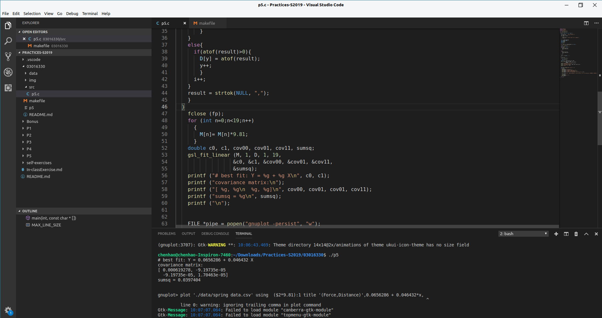
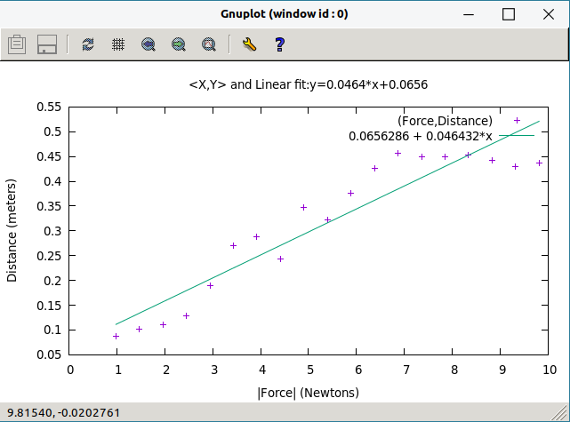

## Bonus

本次的练习主要分为两个部分：第一个部分是学习在Ubuntu下使用Gcc编译器，练习使用GSL进行数据拟合，练习Gnuplot进行绘图；第二个部分是学习使用Git进行版本控制，以及学习以Git为内核的Github的使用；

* 第一部分：
    * Ubuntu是一个基于Debian的免费开源操作系统和Linux发行版。学习适应Ubuntu的使用，可以很好的帮助我们进行一些高端的，复杂的开发，可以使我们跟上主流开发者的脚步。
    * 为了实现对spring_data.csv文件内数据的拟合，我们需要首先读取文件中的数据，并把数据存放为合适的格式。为了方便后面的使用，我们把读取到的文件分别放入D和M数组中。接下来直接使用GSL自带的函数gsl_fit_linear进行数据拟合，拟合得到的结果如下：
    

    * Gnuplot是一个很好用的绘图软件，可以在多种平台上使用，同时符合自由软件的原则。由于我们使用C语言来绘图，所以我们需要用Pipe传递命令和数据。最终绘制的结果如下：
    

* 第二部分：

